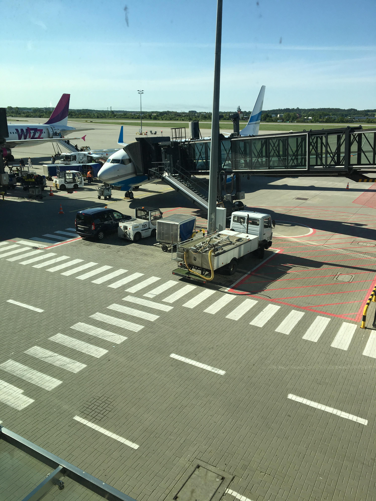

### Mierzyć wysoko

* Informacje zamieszczane na stronie opowiadają o blaskach i cieniach pracy w porcie lotniczym 

* Można tu znaleźć historie napisane przez samo życie


# No to lecimy! 

#### Lotnictwo wciąga. Jest nieprzewidywalne, momentami uciążliwe ze względu na konieczność stosowania niezliczonej liczby procedur. Mimo wszystko pasjonaci widzą więcej. Urok potężnych maszyn, tygiel kultur (bo chyba mało jest miejsc tak pełnych ludzi różnych narodowości, a każda z tych osób wiezie ze sobą bagaż doświadczeń- dosłownie i w przenośni), to również duża dawka adrenaliny wydzielana pod wpływem podejmowania szybkich decyzji, nierzadko bardzo odpowiedzialnych. 

## Agent Obsługi Pasażerskiej- *niezbędnik*

* Plan dnia (rozkład rejsów, które danego dnia obsługuje pracownik)
* Radio (można korzystać z kilku kanałów celem kontaktowania się np. z sortownią, red capem czy kierowcą autobusu)
* Kamizelka odblaskowa (niedopuszczalne jest chodzenie po płycie bez tej części odzieży)
* Przepustka (otwiera wiele magicznych drzwi, do których przeciętni ludzie nie mają dostępu)
* Saszetka na dokmumenty, zawiera m.in:
  + przywieszki limited realese
  + naklejki delivery at aircraft 
  
#### **Popularne linie lotnicze**
1. Wizzair
2. Ryanair
3. Linie charterowe (EnterAir, Smallplanet, Travelservice)
4. KLM
5. Lufthansa
6. Norwegian Airlines

[Tutaj jest link do oficjlanej strony Organizacji Międzynarodwej Lotnictwa Cywilnego- ICAO, można poczytać o przepisach regulujących bezpieczeństwo](https://www.icao.int/Pages/default.aspx)


| Linia Lotnicza | Typ samolotu | max. ilość pasażerów | emergency |
|----------------|--------------|----------------------|-----------|
|       W6       |   A-320      |    180               | row 12,13 |
|       W6       |   A-321      |    220               | row 10,22 |
| FR             |  Boeing 737| 189| row 1,16,17|


` rozwinięcie skrótów W6- Wizzair, FR- Ryanair, A- Airbus` 

```{r include = TRUE }
library(tidyverse)
ggplot (data = mpg) +
  geom_point (mapping = aes (x = displ, y = cty))
```


```{r echo=FALSE}
library(tidyverse)
ggplot (data = mpg, aes(x = class, y = displ)) +
  geom_boxplot() +
  coord_flip() +
  labs(title = "Zależność pojemności silnika od klasy samochodu", x = "Klasa", y = "Pojemność")
```

```{r echo=TRUE}
library(tidyverse)
sto_diam <- diamonds[sample(nrow(diamonds), 100),]
```



